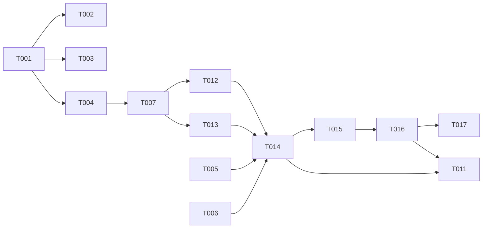

---

description: "Task list template for feature implementation with agent routing and dependency graph"
---

# Tasks: [FEATURE NAME]

**Input**: Design documents from `/specs/[###-feature-name]/`
**Prerequisites**: plan.md (required), spec.md (required for user stories), research.md, data-model.md, contracts/

**Tests**: The examples below include test tasks. Tests are OPTIONAL - only include them if explicitly requested in the feature specification.

**Organization**: Tasks are grouped by user story to enable independent implementation and testing of each story. Each task is assigned to a specialist agent for domain-aware execution.

## Format: `[ID] [AGENT] [Story?] Description`

- **[AGENT]**: Specialist agent responsible for the task (see Agent Tags below)
- **[Story]**: Which user story this task belongs to (e.g., US1, US2, US3)
- Include exact file paths in descriptions
- Parallelism is derived from the Dependency Graph — tasks with no dependencies can run in parallel

## Agent Tags

| Tag | Agent | Domain |
|-----|-------|--------|
| `[SETUP]` | — (orchestrator) | Project init, shared config, scaffolding, shared dependency installs |
| `[DB]` | database-architect | Schema, migrations, seeds, indexes |
| `[BE]` | backend-specialist | API routes, services, middleware, server logic + unit tests |
| `[FE]` | frontend-specialist | Components, pages, styles, client state, UI design + unit tests |
| `[OPS]` | devops-engineer | Docker, CI/CD, infra, deploy configs |
| `[E2E]` | test-engineer | Cross-boundary integration/E2E tests only |
| `[SEC]` | security-auditor | Security audit, vulnerability review (conditional) |

**Assignment rules:**
- By file path: `models/`, `prisma/`, `migrations/` → `[DB]`; `api/`, `services/`, `middleware/` → `[BE]`; `components/`, `pages/`, `app/`, `styles/` → `[FE]`; `Dockerfile`, `.github/workflows/`, `infra/` → `[OPS]`; `tests/e2e/`, `tests/integration/` (cross-domain) → `[E2E]`
- By description fallback: "audit"/"security review" → `[SEC]`; "create schema"/"migration" → `[DB]`
- Phase 1 tasks without clear domain → `[SETUP]`
- `[SEC]` and `[E2E]` are conditional — only include when spec.md/plan.md requires them

## Task Statuses

| Status | Meaning |
|--------|---------|
| `- [ ]` | Pending |
| `- [→]` | In progress |
| `- [X]` | Completed |
| `- [!]` | Failed |
| `- [~]` | Blocked (cascade from a failed dependency) |

## Path Conventions

- **Single project**: `src/`, `tests/` at repository root
- **Web app**: `backend/src/`, `frontend/src/`
- **Mobile**: `api/src/`, `ios/src/` or `android/src/`
- Paths shown below assume single project - adjust based on plan.md structure

<!--
  ============================================================================
  IMPORTANT: The tasks below are SAMPLE TASKS for illustration purposes only.

  The /speckit.tasks command MUST replace these with actual tasks based on:
  - User stories from spec.md (with their priorities P1, P2, P3...)
  - Feature requirements from plan.md
  - Entities from data-model.md
  - Endpoints from contracts/

  Tasks MUST be organized by user story so each story can be:
  - Implemented independently
  - Tested independently
  - Delivered as an MVP increment

  DO NOT keep these sample tasks in the generated tasks.md file.
  ============================================================================
-->

## Phase 1: Setup (Shared Infrastructure)

**Purpose**: Project initialization, basic structure, shared dependency installs

- [ ] T001 [SETUP] Create project structure per implementation plan
- [ ] T002 [SETUP] Initialize project with all shared dependencies
- [ ] T003 [OPS] Configure linting and formatting tools

---

## Phase 2: Foundational (Blocking Prerequisites)

**Purpose**: Core infrastructure that MUST be complete before ANY user story can be implemented

**⚠️ CRITICAL**: No user story work can begin until this phase is complete (phase = sync barrier)

Examples of foundational tasks (adjust based on your project):

- [ ] T004 [DB] Setup database schema and migrations framework
- [ ] T005 [BE] Implement authentication/authorization framework
- [ ] T006 [BE] Setup API routing and middleware structure
- [ ] T007 [DB] Create base models/entities that all stories depend on
- [ ] T008 [BE] Configure error handling and logging infrastructure
- [ ] T009 [OPS] Setup environment configuration management

**Checkpoint**: Foundation ready — user story implementation can now begin

---

## Phase 3: User Story 1 - [Title] (Priority: P1) 🎯 MVP

**Goal**: [Brief description of what this story delivers]

**Independent Test**: [How to verify this story works on its own]

### Tests for User Story 1 (OPTIONAL - only if tests requested) ⚠️

> **NOTE: Write these tests FIRST, ensure they FAIL before implementation**

- [ ] T010 [BE] [US1] Contract test for [endpoint] in tests/contract/test_[name].py
- [ ] T011 [E2E] [US1] Integration test for [user journey] in tests/e2e/test_[name].py

### Implementation for User Story 1

- [ ] T012 [DB] [US1] Create [Entity1] model in src/models/[entity1].py
- [ ] T013 [DB] [US1] Create [Entity2] model in src/models/[entity2].py
- [ ] T014 [BE] [US1] Implement [Service] in src/services/[service].py
- [ ] T015 [BE] [US1] Implement [endpoint] in src/api/[file].py
- [ ] T016 [FE] [US1] Create [Component] in src/components/[component].tsx
- [ ] T017 [FE] [US1] Create [Page] in src/pages/[page].tsx

**Checkpoint**: User Story 1 should be fully functional and testable independently

---

## Phase 4: User Story 2 - [Title] (Priority: P2)

**Goal**: [Brief description of what this story delivers]

**Independent Test**: [How to verify this story works on its own]

### Tests for User Story 2 (OPTIONAL - only if tests requested) ⚠️

- [ ] T018 [BE] [US2] Contract test for [endpoint] in tests/contract/test_[name].py
- [ ] T019 [E2E] [US2] Integration test for [user journey] in tests/e2e/test_[name].py

### Implementation for User Story 2

- [ ] T020 [DB] [US2] Create [Entity] model in src/models/[entity].py
- [ ] T021 [BE] [US2] Implement [Service] in src/services/[service].py
- [ ] T022 [FE] [US2] Create [Component] in src/components/[component].tsx
- [ ] T023 [BE] [US2] Integrate with User Story 1 API (if needed)

**Checkpoint**: User Stories 1 AND 2 should both work independently

---

[Add more user story phases as needed, following the same pattern]

---

## Phase N: Polish & Cross-Cutting Concerns

**Purpose**: Improvements that affect multiple user stories

- [ ] TXXX [OPS] Documentation updates in docs/
- [ ] TXXX [BE] Code cleanup and refactoring
- [ ] TXXX [FE] Performance optimization across all stories
- [ ] TXXX [E2E] Additional E2E tests in tests/e2e/
- [ ] TXXX [SEC] Security hardening and audit
- [ ] TXXX [OPS] Run quickstart.md validation

---

## Dependency Graph

### Legend

- `→` means "unlocks" (left must complete before right can start)
- `+` means "all of these" (join point — ALL listed tasks must complete)
- Tasks not listed here have no dependencies and can start immediately within their phase

### Format Rules (STRICT)

```
# VALID formats (one per line):
T001 → T002                    # single unlock
T001 → T002, T003              # fan-out (one unlocks many)
T002 + T003 → T004             # fan-in (many unlock one)

# INVALID (do NOT produce):
T001 → T002 → T003             # chaining — use two lines
T001, T002 → T003, T004        # multi-to-multi — decompose
```

### Dependencies

T001 → T002, T003, T004        # project setup unlocks all foundational work
T004 → T007                    # DB framework before base models
T007 → T012, T013              # base models unlock story-specific models
T005 + T006 → T014             # auth + routing before service implementation
T012 + T013 → T014             # entity models before service
T014 → T015                    # service before endpoint
T015 → T016                    # API endpoint before FE component (if FE calls API)
T016 → T017                    # component before page
T014 + T016 → T011             # E2E needs both BE and FE ready

### Self-Validation Checklist

> The generator MUST verify before writing:
> - [ ] Every task ID in Dependencies exists in the task list above
> - [ ] No circular dependencies (A→B→A)
> - [ ] No orphan task IDs referenced that don't exist
> - [ ] Fan-in uses `+` only, fan-out uses `,` only
> - [ ] No chained arrows on a single line

---

## Dependency Visualization

> Auto-generated from Dependencies section above. For visual rendering in GitHub/VS Code only — NOT for parsing by the orchestrator.



> **Generator rule:** Convert each Dependency line to mermaid syntax:
> - `T001 → T002` becomes `T001 --> T002`
> - `T001 → T002, T003` becomes `T001 --> T002` and `T001 --> T003` (separate lines)
> - `T002 + T003 → T004` becomes `T002 & T003 --> T004`

---

## Parallel Lanes

| Lane | Agent Flow | Tasks | Blocked By |
|------|-----------|-------|------------|
| 1 | [SETUP] | T001, T002 | — |
| 2 | [DB] | T004 → T007 → T012, T013 | T001 |
| 3 | [BE] | T005, T006 → T008 → T014 → T015 | T001, T007 |
| 4 | [FE] | T016 → T017 | T015 |
| 5 | [OPS] | T003, T009 | T001 |
| 6 | [E2E] | T011 | T014 + T016 |
| 7 | [SEC] | TXXX | all US tasks |

---

## Agent Summary

| Agent | Task Count | Can Start After |
|-------|-----------|-----------------|
| [SETUP] | 2 | immediately |
| [DB] | 4 | T001 |
| [BE] | 5 | T001 |
| [FE] | 2 | T015 |
| [OPS] | 3 | T001 |
| [E2E] | 1 | T014 + T016 |
| [SEC] | 1 | all US complete |

**Critical Path**: T001 → T004 → T007 → T012 → T014 → T015 → T016 → T017

---

## Agent Dispatch Plan

> For each agent that has tasks, provide the context needed to spawn a subagent (Claude Code) or switch role context (Gemini/Copilot). The orchestrator or human uses this table to dispatch without re-reading plan.md.

| Agent | Subagent | Skills | Input Context | Tasks | Files |
|-------|----------|--------|---------------|-------|-------|
| `[SETUP]` | — (orchestrator) | — | plan.md §structure | T001, T002 | `package.json`, `tsconfig.json`, project root |
| `[DB]` | `database-architect` | `database-design` | data-model.md, plan.md §storage | T004, T007, T012, T013 | `src/models/`, `migrations/` |
| `[BE]` | `backend-specialist` | `api-patterns`, `system-design-patterns` | contracts/, plan.md §tech-stack, data-model.md §entities | T005, T006, T008, T014, T015 | `src/api/`, `src/services/`, `src/middleware/` |
| `[FE]` | `frontend-specialist` | `react-patterns`, `tailwind-patterns`, `frontend-design` | contracts/ §endpoints, plan.md §ui-framework | T016, T017 | `src/components/`, `src/pages/` |
| `[OPS]` | `devops-engineer` | `deployment-procedures` | plan.md §infra, quickstart.md | T003, T009 | `Dockerfile`, `.github/workflows/`, `infra/` |
| `[E2E]` | `test-engineer` | `testing-patterns`, `webapp-testing` | contracts/, quickstart.md §scenarios | T011 | `tests/e2e/`, `tests/integration/` |
| `[SEC]` | `security-auditor` | `vulnerability-scanner` | spec.md §security, plan.md §auth | TXXX | project-wide |

<!--
  ============================================================================
  GENERATOR RULES for Agent Dispatch Plan:

  1. Only include agents that have actual tasks (skip unused conditional agents)
  2. Skills: pull from .claude/agents/<agent>.md frontmatter `skills:` field
  3. Input Context: list specific sections from plan.md/data-model.md/contracts/
     that the agent needs — NOT the whole file
  4. Tasks: list actual task IDs assigned to this agent
  5. Files: list directories/files the agent will create or modify
  6. For conditional agents ([PERF], [DOC], [DEBUG], [REFACTOR], [SEO], [MOBILE],
     [UIUX], [PENTEST], [GAME]) — add rows only when tasks exist

  Additional conditional agent mappings (add row if tasks exist):
  - [PERF]     → performance-optimizer  → performance-profiling
  - [DOC]      → documentation-writer   → documentation-templates
  - [DEBUG]    → debugger               → systematic-debugging
  - [REFACTOR] → (general-purpose)      → legacy-code, testing-patterns
  - [SEO]      → seo-specialist         → seo-fundamentals, geo-fundamentals
  - [MOBILE]   → mobile-developer       → mobile-design + framework-specific
  - [UIUX]     → (general-purpose)      → ui-ux-pro-max, frontend-design
  - [PENTEST]  → penetration-tester     → red-team-tactics
  - [GAME]     → game-developer         → game-development
  ============================================================================
-->

---

## Implementation Strategy

### MVP First (User Story 1 Only)

1. Complete Phase 1: Setup
2. Complete Phase 2: Foundational (CRITICAL — blocks all stories)
3. Complete Phase 3: User Story 1
4. **STOP and VALIDATE**: Test User Story 1 independently
5. Deploy/demo if ready

### Incremental Delivery

1. Complete Setup + Foundational → Foundation ready
2. Add User Story 1 → Test independently → Deploy/Demo (MVP!)
3. Add User Story 2 → Test independently → Deploy/Demo
4. Each story adds value without breaking previous stories

### Parallel Agent Strategy (Claude Code)

1. Orchestrator completes Setup phase directly
2. Once Setup complete (sync barrier) → dispatch parallel agents:
   - Lane 2 `[DB]`: database-architect handles schema + models
   - Lane 3 `[BE]`: backend-specialist handles auth + services (after DB models ready)
   - Lane 5 `[OPS]`: devops-engineer handles CI/CD (independent)
3. As agents complete → unblock dependent lanes
4. `[FE]` starts when its API dependencies are ready
5. `[E2E]` starts when both BE and FE are ready
6. `[SEC]` runs after all story tasks complete

### Multi-Session Strategy (Gemini / Copilot)

1. Complete Setup + Foundational sequentially
2. Use Agent Summary to decide role context switching
3. Optionally launch parallel sessions per agent lane manually
4. Follow Dependency Graph for correct execution order

---

## Notes

- `[AGENT]` tag assigns responsibility — domain agent writes both code and unit tests
- `[E2E]` only for cross-boundary tests — unit tests stay with domain agent
- `[SEC]` is conditional — only when security requirements exist in spec
- Phases are sync barriers — all tasks in a phase must complete/fail/block before next phase
- Each user story should be independently completable and testable
- Commit after each task or logical group
- Stop at any checkpoint to validate story independently
- Avoid: vague tasks, same file conflicts, cross-story dependencies that break independence
